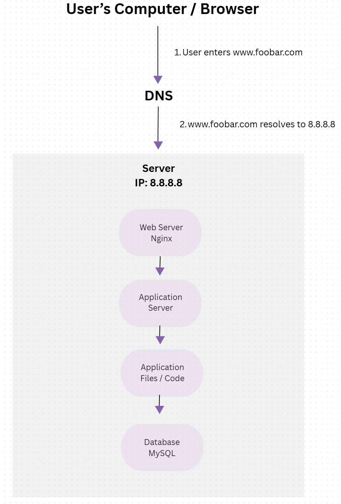
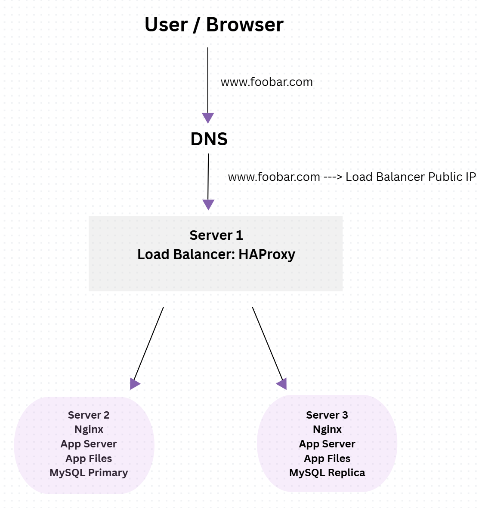

# 0. Simple Web Stack

## Explanation

A user wants to access the website `www.foobar.com` from their computer. The user types the domain name into the browser. The browser asks DNS to resolve `www.foobar.com` into an IP address. The DNS record points `www.foobar.com` to the server IP address `8.8.8.8`. Then the browser sends a request to the server using the Internet, mainly through the HTTP or HTTPS protocol over TCP/IP.

The infrastructure contains one server. A server is a physical or virtual machine that provides services to other computers over a network. In this case, the server hosts the whole website infrastructure.

The domain name is `foobar.com`. The role of the domain name is to give users a human-readable name instead of asking them to remember the server IP address. The `www` in `www.foobar.com` is a subdomain. In this task, it is configured as a DNS record that points to the server IP `8.8.8.8`. The DNS record type is an **A record** because it maps a hostname to an IPv4 address.

Inside the server, there is a web server, which is **Nginx**. The role of Nginx is to receive HTTP or HTTPS requests from the user’s browser. It can serve static files directly, such as HTML, CSS, JavaScript, and images. It can also forward dynamic requests to the application server.

The application server runs the backend logic of the website. It executes the application code and processes requests that need business logic, such as login, forms, user accounts, or dynamic pages.

The application files are the website’s code base. They contain the source code used by the application server to generate the website’s dynamic content.

The database is **MySQL**. Its role is to store and manage the website’s data, such as users, posts, products, sessions, or any other persistent information needed by the application.

The server communicates with the user’s computer using network protocols. The main communication uses **HTTP or HTTPS** for web requests, running on top of **TCP/IP**.

## Issues with this Infrastructure

This infrastructure has several problems.

First, it has a **SPOF**, which means **Single Point of Failure**. Since everything is hosted on one server, if that server goes down, the whole website becomes unavailable. The web server, application server, application files, and database are all on the same machine, so one failure can stop the entire website.

Second, there can be downtime during maintenance. For example, if we need to deploy new code or restart Nginx or the application server, the website may become temporarily unavailable because there is no second server to continue serving traffic.

Third, this infrastructure cannot scale well if there is too much incoming traffic. Since there is only one server, all requests go to the same machine. If traffic increases too much, the server can become overloaded in CPU, memory, disk, or network usage, causing the website to become slow or unavailable.

---

# 1. Distributed Web Infrastructure

## Explanation

A user wants to access the website `www.foobar.com` from their computer. The user types the domain name into the browser. DNS resolves `www.foobar.com` to the public IP address of the load balancer. The user’s request reaches the **HAProxy load balancer** first, then the load balancer forwards the request to one of the two backend servers.

This infrastructure uses three servers in total. The first server contains the **HAProxy load balancer**. The other two servers host the website. Each backend server contains an **Nginx web server**, an **application server**, a set of **application files**, and a **MySQL database**.

The load balancer is added to distribute incoming traffic between the two backend servers. This improves availability and allows the infrastructure to handle more traffic than a single-server setup. If one backend server becomes unavailable, the load balancer can forward traffic to the other available server.

The second backend server is added for redundancy and scalability. Instead of having only one server handling all user requests, both backend servers can serve the website. Each server has its own Nginx web server, application server, and application files, so both servers are able to process requests.

The load balancer is configured with the **Round Robin** distribution algorithm. Round Robin works by sending requests to each backend server in order. For example, the first request goes to Server 1, the second request goes to Server 2, the third request goes back to Server 1, and so on.

This setup is an **Active-Active** setup because both backend servers are active and receiving traffic at the same time. In an Active-Active setup, all servers are used to handle requests. In an Active-Passive setup, one server handles traffic while the other server stays on standby and is only used if the active server fails.

The MySQL databases are configured as a **Primary-Replica** cluster. The Primary database handles write operations, such as creating, updating, or deleting data. The Replica database copies data from the Primary database and can be used for read operations. Replication helps improve redundancy and can also improve read performance.

The difference between the Primary node and the Replica node is that the application writes data to the Primary database, while the Replica database mainly receives copied data from the Primary. The Replica should not usually be used for direct write operations because this could create data conflicts or inconsistency.

## Issues with this Infrastructure

This infrastructure still has several problems.

First, the load balancer is a **SPOF**, which means **Single Point of Failure**. If the HAProxy load balancer goes down, users cannot reach the backend servers, even if the backend servers are still running.

Second, the Primary database is also a **SPOF** for write operations. If the Primary database goes down, the application may not be able to create, update, or delete data unless a failover system is configured.

Third, there are security issues because there is no firewall. Without firewalls, the servers may expose unnecessary ports and services to the Internet.

Fourth, there is no HTTPS. This means communication between the user and the website is not encrypted, which can expose sensitive data.

Finally, there is no monitoring. Without monitoring, the team cannot easily detect server failures, high CPU or memory usage, database problems, slow response times, or website downtime.
