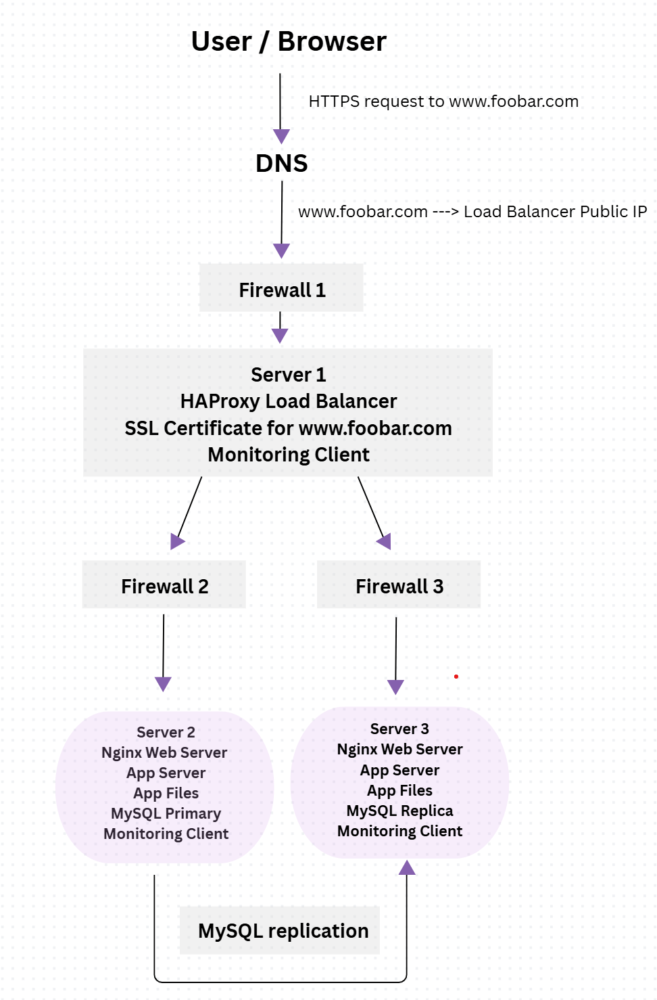
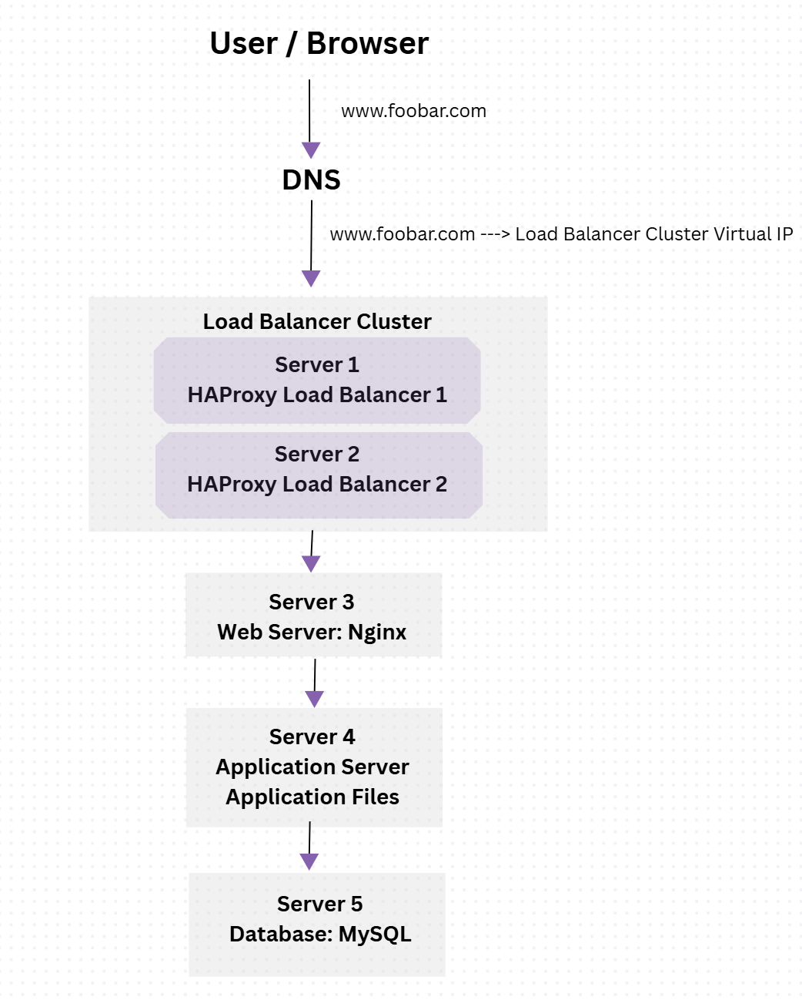

# 0. Simple Web Stack

## Explanation

A user wants to access the website `www.foobar.com` from their computer. The user types the domain name into the browser. The browser asks DNS to resolve `www.foobar.com` into an IP address. The DNS record points `www.foobar.com` to the server IP address `8.8.8.8`. Then the browser sends a request to the server using the Internet, mainly through the HTTP or HTTPS protocol over TCP/IP.

The infrastructure contains one server. A server is a physical or virtual machine that provides services to other computers over a network. In this case, the server hosts the whole website infrastructure.

The domain name is `foobar.com`. The role of the domain name is to give users a human-readable name instead of asking them to remember the server IP address. The `www` in `www.foobar.com` is a subdomain. In this task, it is configured as a DNS record that points to the server IP `8.8.8.8`. The DNS record type is an **A record** because it maps a hostname to an IPv4 address.

Inside the server, there is a web server, which is **Nginx**. The role of Nginx is to receive HTTP or HTTPS requests from the user’s browser. It can serve static files directly, such as HTML, CSS, JavaScript, and images. It can also forward dynamic requests to the application server.

The application server runs the backend logic of the website. It executes the application code and processes requests that need business logic, such as login, forms, user accounts, or dynamic pages.

The application files are the website’s code base. They contain the source code used by the application server to generate the website’s dynamic content.

The database is **MySQL**. Its role is to store and manage the website’s data, such as users, posts, products, sessions, or any other persistent information needed by the application.

The server communicates with the user’s computer using network protocols. The main communication uses **HTTP or HTTPS** for web requests, running on top of **TCP/IP**.

## Issues with this Infrastructure

This infrastructure has several problems.

First, it has a **SPOF**, which means **Single Point of Failure**. Since everything is hosted on one server, if that server goes down, the whole website becomes unavailable. The web server, application server, application files, and database are all on the same machine, so one failure can stop the entire website.

Second, there can be downtime during maintenance. For example, if we need to deploy new code or restart Nginx or the application server, the website may become temporarily unavailable because there is no second server to continue serving traffic.

Third, this infrastructure cannot scale well if there is too much incoming traffic. Since there is only one server, all requests go to the same machine. If traffic increases too much, the server can become overloaded in CPU, memory, disk, or network usage, causing the website to become slow or unavailable.

---

# 1. Distributed Web Infrastructure

## Explanation

A user wants to access the website `www.foobar.com` from their computer. The user types the domain name into the browser. DNS resolves `www.foobar.com` to the public IP address of the load balancer. The user’s request reaches the **HAProxy load balancer** first, then the load balancer forwards the request to one of the two backend servers.

This infrastructure uses three servers in total. The first server contains the **HAProxy load balancer**. The other two servers host the website. Each backend server contains an **Nginx web server**, an **application server**, a set of **application files**, and a **MySQL database**.

The load balancer is added to distribute incoming traffic between the two backend servers. This improves availability and allows the infrastructure to handle more traffic than a single-server setup. If one backend server becomes unavailable, the load balancer can forward traffic to the other available server.

The second backend server is added for redundancy and scalability. Instead of having only one server handling all user requests, both backend servers can serve the website. Each server has its own Nginx web server, application server, and application files, so both servers are able to process requests.

The load balancer is configured with the **Round Robin** distribution algorithm. Round Robin works by sending requests to each backend server in order. For example, the first request goes to Server 1, the second request goes to Server 2, the third request goes back to Server 1, and so on.

This setup is an **Active-Active** setup because both backend servers are active and receiving traffic at the same time. In an Active-Active setup, all servers are used to handle requests. In an Active-Passive setup, one server handles traffic while the other server stays on standby and is only used if the active server fails.

The MySQL databases are configured as a **Primary-Replica** cluster. The Primary database handles write operations, such as creating, updating, or deleting data. The Replica database copies data from the Primary database and can be used for read operations. Replication helps improve redundancy and can also improve read performance.

The difference between the Primary node and the Replica node is that the application writes data to the Primary database, while the Replica database mainly receives copied data from the Primary. The Replica should not usually be used for direct write operations because this could create data conflicts or inconsistency.

## Issues with this Infrastructure

This infrastructure still has several problems.

First, the load balancer is a **SPOF**, which means **Single Point of Failure**. If the HAProxy load balancer goes down, users cannot reach the backend servers, even if the backend servers are still running.

Second, the Primary database is also a **SPOF** for write operations. If the Primary database goes down, the application may not be able to create, update, or delete data unless a failover system is configured.

Third, there are security issues because there is no firewall. Without firewalls, the servers may expose unnecessary ports and services to the Internet.

Fourth, there is no HTTPS. This means communication between the user and the website is not encrypted, which can expose sensitive data.

Finally, there is no monitoring. Without monitoring, the team cannot easily detect server failures, high CPU or memory usage, database problems, slow response times, or website downtime.

---

# 2. Secured and Monitored Web Infrastructure

## Explanation

A user wants to access the website `www.foobar.com` from their computer. The user types the domain name into the browser. DNS resolves `www.foobar.com` to the public IP address of the load balancer. The user’s browser sends an **HTTPS** request to the infrastructure. The request passes through a firewall, reaches the **HAProxy load balancer**, and is then forwarded to one of the backend servers.

This infrastructure uses three servers in total. The first server contains the **HAProxy load balancer**, an **SSL certificate**, and a monitoring client. The two backend servers each contain an **Nginx web server**, an **application server**, a set of **application files**, a **MySQL database**, and a monitoring client.

Three firewalls are added to improve security. A firewall is used to control incoming and outgoing network traffic based on security rules. The first firewall protects the load balancer from unwanted external traffic. The other two firewalls protect the backend servers and help make sure that only allowed traffic, such as traffic coming from the load balancer, can reach them.

An SSL certificate is added to serve `www.foobar.com` over **HTTPS**. HTTPS encrypts the traffic between the user’s browser and the website. This protects sensitive data, such as login information, personal information, cookies, and session data, from being read or modified by attackers during transmission.

Monitoring clients are added to all three servers. Monitoring is used to observe the health and performance of the infrastructure. It helps detect problems such as server downtime, high CPU usage, high memory usage, disk problems, network issues, slow response times, and application errors.

The monitoring tool collects data through a monitoring client, also called an agent or data collector, installed on each server. The agent collects metrics, logs, and service information from the server, then sends that data to a monitoring platform such as Sumo Logic, Datadog, New Relic, or another monitoring service. The monitoring platform can then display dashboards and send alerts when something unusual happens.

To monitor the web server QPS, which means Queries Per Second, we need to collect request metrics from Nginx. This can be done by enabling Nginx access logs or an Nginx status module, then configuring the monitoring agent to collect and send the number of requests per second to the monitoring platform. A dashboard or alert can then be created to track the QPS of the web server.

## Issues with this Infrastructure

This infrastructure is more secure and monitored than the previous one, but it still has several problems.

First, terminating SSL at the load balancer level can be an issue because the traffic is encrypted only between the user and the load balancer. After the load balancer decrypts the request, the traffic between the load balancer and the backend servers may travel without encryption. If the internal network is compromised, sensitive data could be exposed.

Second, having only one MySQL server capable of accepting writes is an issue. In a Primary-Replica database setup, only the Primary database handles write operations. If the Primary database goes down, the application may not be able to create, update, or delete data unless a failover system is configured. This makes the Primary database a Single Point of Failure for write operations.

Third, having servers with all the same components can be a problem. Each backend server contains a web server, application server, and database. This can create resource competition because the database, web server, and application server are all using CPU, memory, disk, and network resources on the same machines. It also makes the infrastructure harder to scale because each layer cannot be scaled independently. For example, if only the database needs more power, we cannot scale just the database layer easily. It can also create security and maintenance issues because different services with different responsibilities are mixed together on the same servers.

---

# 3. Scale Up

## Explanation

A user wants to access the website `www.foobar.com` from their computer. The user types the domain name into the browser. DNS resolves `www.foobar.com` to the virtual IP address of the load balancer cluster. The request reaches one of the **HAProxy load balancers**, then the load balancer forwards the request to the web server.

This infrastructure separates the main components of the web stack into their own servers. The load balancing layer is handled by two HAProxy load balancers configured as a cluster. The web server, application server, and database are each placed on separate servers.

A second load balancer is added to remove the load balancer as a Single Point of Failure. In the previous infrastructure, if the only load balancer failed, users would not be able to reach the website. By adding another HAProxy load balancer and configuring both load balancers as a cluster, the infrastructure becomes more available.

The two HAProxy load balancers can be configured as an **Active-Passive cluster** using a virtual IP address. In this setup, one load balancer actively receives traffic, while the second load balancer stays on standby. If the active load balancer fails, the passive load balancer takes over the virtual IP address and continues serving traffic. This helps avoid downtime if one load balancer goes down.

The web server is placed on its own server. The role of the web server, such as **Nginx**, is to receive HTTP or HTTPS requests and serve static content. It can also forward dynamic requests to the application server.

The application server is placed on its own server. The application server runs the backend logic of the website and executes the application files. Separating it from the web server makes the infrastructure easier to scale and maintain.

The database is placed on its own server. The database, such as **MySQL**, stores and manages persistent data. Keeping the database separate improves organization and allows the database layer to be scaled, secured, backed up, and maintained independently.

Splitting the components into separate servers is important because each layer has different responsibilities and resource needs. The web server may need to handle many network requests, the application server may need more CPU for business logic, and the database may need more memory and disk performance. By separating them, each layer can be scaled and optimized independently.

## Why These Elements Are Added

The additional load balancer is added to increase availability and avoid having only one load balancer as a Single Point of Failure.

The load balancer cluster is added so that if one HAProxy server fails, the other one can continue handling traffic.

The separate web server is added to handle web traffic and serve static content independently.

The separate application server is added to run the backend logic independently from the web server.

The separate database server is added to store and manage application data independently from the web and application layers.

This design is more scalable than previous infrastructures because the web, application, and database layers can now be improved, maintained, and scaled separately.
